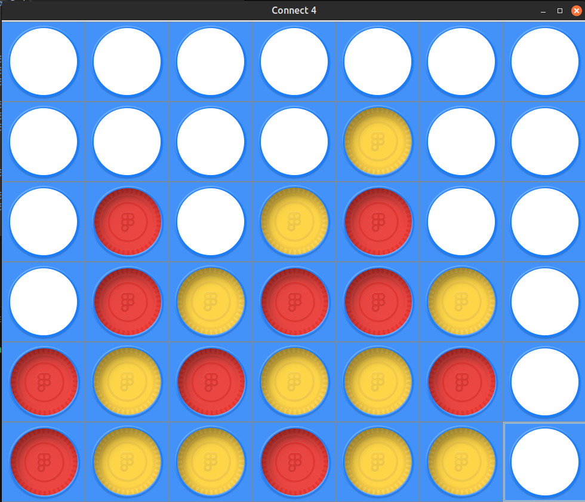
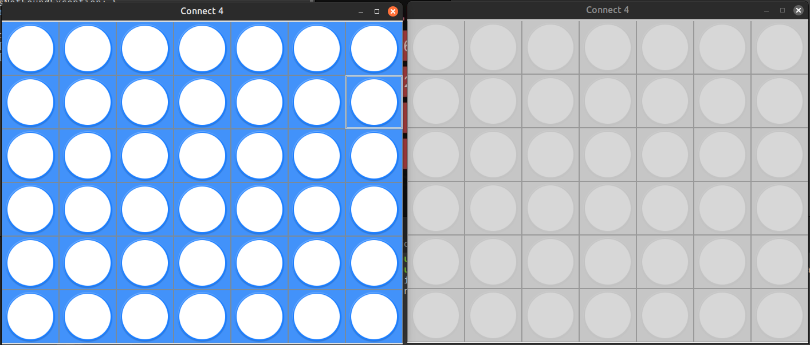
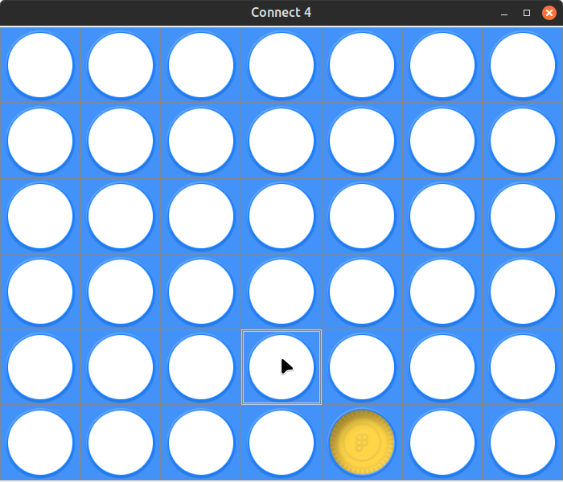
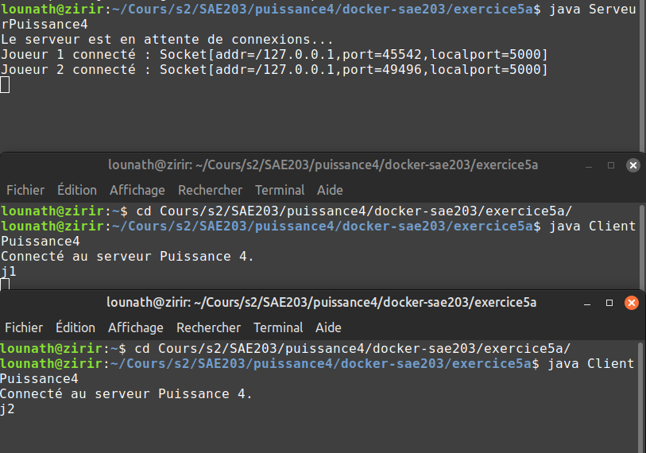
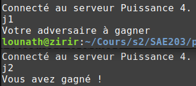

## Equipe 04
- Mohamed-Bilel CHRIKI
- Théo PORET
- Yanis YACHIR
- Marilou ZIRI
  
# Projet : Puissance 4
### Les différentes tâches
- Création du Puissance 4 en java
- Création du Serveur et du Client en java
- Mise en relation avec le docker

Le Puissance 4 final se présente sous la forme ci-dessous :

## Puissance 4

Pour la création du Puissance 4, nous l'affichons avec une interface graphique en swing. Notre puissance 4 est constitué d'une frame pour qu'il soit en en dehors d'un terminal et que cela soit plus simple à utiliser plutôt que de rentre des coordonnées dans le terminal, cela est donc plus simple pour jouer. 

Nous avons donc ajouté sur cette frame des boutons dans les cases du tableau pour éviter d'utiliser des flèches ou de rentrer des coordonnées.

Quant à la création du serveur et du client, nous avons fait en sorte qu'il y'ait une connexion entre le client et le seveur, lorque deux clients sont connectés, la partie peut commencer. 

Cela fait, une frame pour chaque client se mettant à jour automatiquement après qu'un des joueurs ait placé un jeton apparait et les joueurs peuvent commencer la partie.
//image debut de  game

A la fin, quand un joueur gagne, un message sortant dans le terminal du serveur indique le gagnant et les frames se ferment. Si personne ne gagne, personne n'est mentionné dans le terminal du serveur et les frames se ferment.

## Docker

Enfin le docker fait fonctionner les différentes frames des clients en réseau.
//image docker

Tout cela a permit de faire fonctionner en réseau notre Puissance 4.

## Problèmes rencontrés :

- Nous avons eu des problèmes par rapport à la mise en relation entre les deux clients avec le docker (localhost et adresse IP).
- L'interface graphique devait passer par le client et pas uniquement par le serveur, ce qui était faisable en local.

